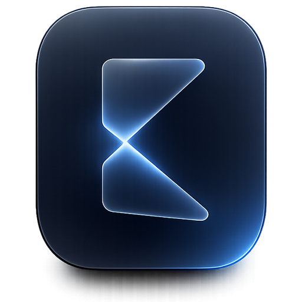
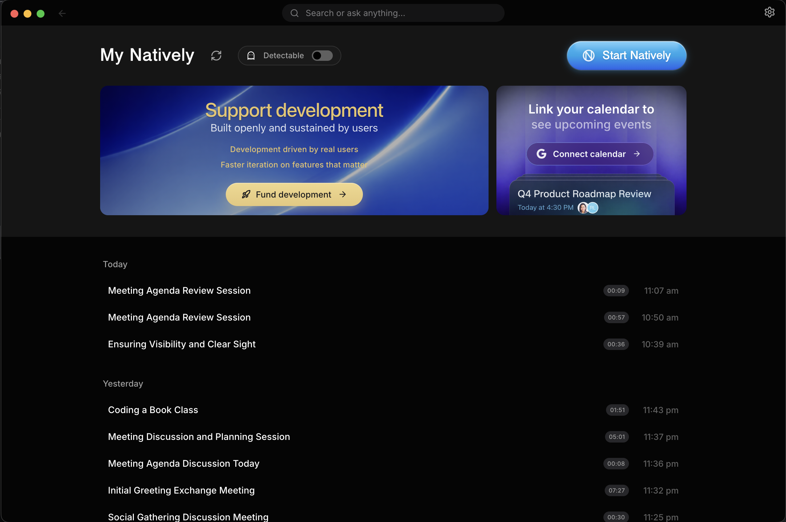
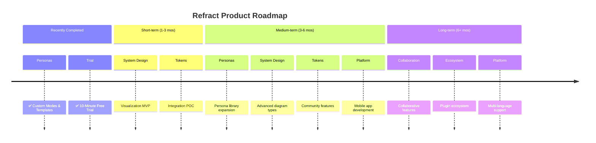

<div align="center">
  

# Refract — The Private, On-Device AI Copilot for Meetings & Interviews

**Real-time transcription, memory, and answers that never leave your machine.**
<br/>
**Bring your own model. Own your data. $0 to start. Source-available and auditable.**
<br/>

[](LICENSE)
[](https://github.com/Refract-AI-assistant/refract/releases)
[](https://github.com/Refract-AI-assistant/refract/releases)

[](https://github.com/Refract-AI-assistant/refract)

[](https://t.me/refractaichat)

> **Competitors charge $20–$149/month, store your data on their servers, and one already breached 83,000 users.** Refract costs $0, runs locally, and has never had a data breach. Your keys, your models, your machine.

<p align="center">
  <a href="https://refract.software">
    
  </a>
</p>

<p align="center">
  <a href="https://github.com/Refract-AI-assistant/refract/releases/latest">
    
  </a>
  <a href="https://github.com/Refract-AI-assistant/refract/releases/latest">
    
  </a>
</p>

<small>Requires macOS 12+ (Apple Silicon & Intel) or Windows 10/11</small>

<br/>

**<span style="color: #ef4444">👥 9,000+ Users</span>** &nbsp;·&nbsp; **<span style="color: #f97316">🔥 700+ DAU</span>** &nbsp;·&nbsp; **<span style="color: #22c55e">💸 $0 vs $149/mo rivals</span>** &nbsp;·&nbsp; **<span style="color: #3b82f6">⚡ <500ms latency</span>** &nbsp;·&nbsp; **<span style="color: #a855f7">🛡️ 0 data breaches</span>**

</div>

---

## Built for privacy from the first line of code

Refract is a native intelligence system for high-stakes meetings and interviews. It listens, remembers, and answers in real time — entirely on your own machine, with the model *you* choose. No servers hold your transcripts. No vendor holds your keys. The overlay stays invisible; your data stays yours.

> Private by architecture, not by promise. Bring your own model, run fully offline, and audit every line — the source is published for that reason.

---

## What Users Are Saying

> "This is a fantastic piece of software and you should definitely keep up the great work! This is exactly what I was looking for. I started out trying the free version, and because it worked so well, I decided to go ahead and buy the full premium license."  
> — **Oskar Krzak** (⭐⭐⭐⭐⭐ via Gumroad)

> "Refract is significantly faster than Refract when it comes to response time and screen analysis. The latency is practically non-existent."  
> — **Premium User**

> "Just wanted to say thanks! Refract helped me completely crack the first two rounds of my Software Engineering interviews. The responses were incredibly fast and accurate."  
> — **Private Email Feedback**

> "Used the free version of Refract for my interviews and just landed a massive summer internship. It took all the stress out of the live coding and behavioral rounds!"  
> — **Private Email Feedback**

---

## Why Refract?

While other tools act as simple API wrappers, Refract is a complete, native intelligence system designed specifically for high-stakes meetings and interviews.

- **Native Audio Capture (<500ms):** Built with Rust and Zero-Copy ABI transfers, bypassing generic web-audio limitations for ultra-low latency.
- **Local Whisper STT (On-Device):** 100% on-device speech-to-text using optimized ONNX models (Moonshine-tiny, Moonshine-base, Whisper-large-v3-turbo, distil-large-v3). Uses hardware acceleration (CoreML/Metal GPU on Apple Silicon, DirectML on Windows, quantized int8 on CPU) with zero cloud fees or data exposure.
- **Dual-Channel Intelligence:** Distinct pipelines for system audio (what they say) and your microphone (what you dictate) ensuring perfect transcription without room noise.
- **Battle-Tested Stealth Mode:** Completely undetectable. Hides from the dock, disables popups, and disguises the process during screen sharing.
- **Modes Manager (7 Personas):** Toggle between 7 tailored personas (General, Technical Interview, Looking for Work, Sales, Recruiting, Team Meet, and Lecture) with custom system prompts and dynamic meeting-note templates.
- **Custom Context & Notes:** A dedicated free-form notes area to paste instructions, crib sheets, or credentials (up to 8,000 characters), automatically injected into real-time LLM prompts.
- **Rolling Context:** We don't just transcribe; we maintain a "memory window" of the conversation for smarter answers.
- **Local RAG Memory:** We embed your meetings locally using SQLite vector search so you can ask, "What did John say about the API last week?"
- **Reference Files:** Deeply integrate PDFs, DOCX, and TXT files as real-time context.
- **Rich Dashboard:** A full UI to manage, search, and export your history—not just a floating window.
- **Fully Offline Capable:** Don't trust the cloud? Run Refract 100% offline using local Ollama models and local Whisper STT.

---

## 3 things you should know before choosing an interview AI

1. **Cluely** had a data breach in mid-2025 that exposed 83,000 users' personal info, transcripts, and screenshots — Refract stores everything locally by default with limited anonymous telemetry and has never had a breach.
2. **Final Round AI** costs $149/month and its taskbar icon is visible to proctoring software — Refract is free to start, its source is auditable, and it has a battle-tested undetectable stealth mode.
3. **LockedIn AI** charges $55–70/month and locks you into their cloud LLM with no local option — Refract lets you use any model (GPT, Claude, Gemini, Llama) or go fully offline with Ollama.

---

<div align="center">

### ⭐ Star this repo — it matters

Every star pushes Refract higher in GitHub search, helping developers and job seekers find a free, private alternative instead of paying $149/month for tools that store their data on someone else's server.

[](https://github.com/Refract-AI-assistant/refract)

</div>

---

## Demo


This demo shows **a complete live meeting scenario**:

- Real-time transcription as the meeting happens
- Rolling context awareness across multiple speakers
- Screenshot analysis of shared slides
- Instant generation of what to say next
- Follow-up questions and concise responses
- All happening live, without recording or post-processing

---

## Full Comparison: Refract vs Cluely vs Final Round AI vs LockedIn AI vs Interview Coder

| Feature                   | Refract                   | Cluely               | Pluely     | LockedIn AI      | Final Round AI         |
| :------------------------ | :------------------------- | :------------------- | :--------- | :--------------- | :--------------------- |
| **Price**                 | ✅ Free (BYOK)             | ⚠️ $20/mo            | ✅ Free    | ❌ $55–70/mo     | ❌ $149/mo             |
| **Source auditable**      | ✅ published               | ❌                   | ✅         | ❌               | ❌                     |
| **Local data / private**  | ✅ Yes                     | ❌ Cloud servers     | ✅ Yes     | ❌ Cloud servers | ❌ Cloud servers       |
| **Any LLM (BYOK)**        | ✅ Yes                     | ❌ Vendor-locked     | ⚠️ Limited | ❌ Vendor-locked | ❌ Vendor-locked       |
| **Local AI (Ollama)**     | ✅ Yes                     | ❌                   | ❌         | ❌               | ❌                     |
| **Local Whisper (On-Device)**| ✅ Yes                   | ❌                   | ❌         | ❌               | ❌                     |
| **Real-time <500ms**      | ✅ Yes                     | ⚠️ 5–90s lag         | ✅ Yes     | ✅ ~116ms        | ⚠️ Slowest             |
| **Dual audio channels**   | ✅ System + Mic            | ❌ Single stream     | ❌         | ❌               | ❌                     |
| **Local RAG memory**      | ✅ SQLite + sqlite-vec     | ❌                   | ❌         | ❌               | ❌                     |
| **Meeting history**       | ✅ Full dashboard          | ⚠️ Limited           | ❌         | ❌               | ⚠️ Limited             |
| **Screenshot OCR**        | ✅ Yes                     | ⚠️ Limited           | ❌         | ✅ Yes           | ⚠️ Limited             |
| **Stealth mode**          | ✅ Undetectable            | ❌                   | ❌         | ❌               | ❌ Visible to proctors |
| **Process Disguise**      | ✅ Terminal, Settings, etc | ❌                   | ❌         | ❌               | ❌                     |
| **Resume & context**      | ✅ Pro                     | ❌                   | ❌         | ✅ Yes           | ✅ Yes                 |
| **Custom Personas/Modes** | ✅ Pro                     | ✅ Yes               | ❌         | ❌               | ⚠️ Limited             |
| **Custom Context & Notes**| ✅ Pro                     | ❌                   | ❌         | ❌               | ❌                     |
| **Multi-Key API Pools**   | ✅ Yes                     | ❌                   | ❌         | ❌               | ❌                     |
| **Profile Intel Router**  | ✅ Yes                     | ❌                   | ❌         | ❌               | ❌                     |
| **Eager Code Expansion**  | ✅ Yes                     | ❌                   | ❌         | ❌               | ❌                     |
| **Live Follow-Up Resolver**| ✅ Yes                     | ❌                   | ❌         | ❌               | ❌                     |
| **Real-Time Latency Trace**| ✅ Yes                    | ❌                   | ❌         | ❌               | ❌                     |
| **Phone Link Companion**  | ✅ Yes                     | ❌                   | ❌         | ❌               | ❌                     |
| **Auto-Calendar Sync**    | ✅ Yes                     | ❌                   | ❌         | ❌               | ❌                     |
| **Smart Task Sync**       | ✅ Yes                     | ❌                   | ❌         | ❌               | ❌                     |
| **Speaker Diarization**   | ✅ Yes                     | ❌                   | ❌         | ❌               | ❌                     |
| **Codex CLI Integration** | ✅ Yes                     | ❌                   | ❌         | ❌               | ❌                     |
| **Offline SLM Mode**      | ✅ Yes                     | ❌                   | ❌         | ❌               | ❌                     |
| **Stateful Intelligence OS** | ✅ Yes                    | ❌                   | ❌         | ❌               | ❌                     |
| **Spoken Answer Humanizer** | ✅ Yes                     | ❌                   | ❌         | ❌               | ❌                     |
| **Sandboxed Code Verification** | ✅ Yes                  | ❌                   | ❌         | ❌               | ❌                     |
| **Hindsight LTM Vector DB** | ✅ Yes                    | ❌                   | ❌         | ❌               | ❌                     |
| **Regional STT Relay**    | ✅ Yes                     | ❌                   | ❌         | ❌               | ❌                     |
| **Data breach history**   | ✅ None                    | ❌ 83k users exposed | ✅ None    | ✅ None          | ✅ None                |

> **Legend:** ✅ Full support · ⚠️ Partial or limited · ❌ Not available

---

## Why Refract wins

### vs Cluely — breached 83,000 users

Cluely's mid-2025 data breach exposed personal information, full interview transcripts, and screenshots of 83,000 users. Every word spoken during an interview was stored on their servers — and then leaked. They charge $20/month for this privilege.

By default, Refract stores everything on your local machine, with only limited anonymous telemetry (basic GA4 install tracking, zero personal data). Your transcripts, API keys, and screenshots never leave your machine when using your own keys. The entire codebase is published and auditable (source-available license — see LICENSE). Zero breaches — that is the only acceptable standard for a tool that listens to your interviews.

Refract gives you complete control over the AI: **Custom Persona Modes** (Tech, Sales, Recruiting) to strictly format behavior, and **Reference Files** capabilities to upload PDFs so the AI knows exactly the context of the job or meeting before it starts.

### vs LockedIn AI — $70/month for cloud lock-in

LockedIn AI is the most expensive tool in the category at $55–70/month. It locks you into a single cloud LLM with no option for local inference. Every transcript and response passes through their servers.

Refract supports every major model (Gemini, GPT, Claude, Groq) via bring-your-own-key, and offers 100% offline mode through Ollama. You pay only for the API tokens you actually use — or pay nothing at all by running Llama 3 locally. No subscription, no vendor lock-in.

### vs Final Round AI — $149/month and visible to proctors

Final Round AI is the most expensive option at $149/month, optimized for pre-interview prep and mock interviews but with the slowest live latency in the category. Critically, its taskbar icon is visible to proctoring software, making it detectable during monitored interviews.

Refract delivers <500ms end-to-end latency using Rust-based native audio capture with Zero-Copy ABI Transfers. Its undetectable stealth mode hides from the dock, disguises process names, and syncs state across all windows — battle-tested and hardened across five major releases.

### vs Pluely — lightweight but limited

Pluely is a solid lightweight alternative (~10MB, Tauri-based) and it has Linux support, which Refract does not yet offer. Credit where it is due.

But Pluely is a basic overlay. It has no local RAG, no meeting history, no dual audio channels, and no dashboard. Refract is a complete intelligence system: it remembers your past meetings via local vector search, separates system audio from your microphone, and gives you a full management dashboard with export to Markdown, JSON, and Text.

### vs Interview Coder — More Powerful, Completely Free

Interview Coder is a paid tool focused specifically on coding interview assistance. Refract does everything Interview Coder does — and more — for free:

|                                    |    Refract    | Interview Coder |
| :--------------------------------- | :------------: | :-------------: |
| **Price**                          | ✅ Free (BYOK) |     ❌ Paid     |
| **Source auditable**               |       ✅       |       ❌        |
| **Works on LeetCode / HackerRank** |       ✅       |       ✅        |
| **Screenshot + OCR analysis**      |       ✅       |       ✅        |
| **Real-time overlay**              |       ✅       |       ✅        |
| **Local AI / offline mode**        |   ✅ Ollama    |       ❌        |
| **Behavioral interview support**   |       ✅       |       ❌        |
| **System design support**          |       ✅       |       ❌        |
| **Meeting history & RAG**          |       ✅       |       ❌        |
| **Any LLM (BYOK)**                 |       ✅       |    ❌ Locked    |
| **Data stored locally**            |       ✅       |    ❌ Cloud     |

Refract covers the full interview loop — not just the coding round.

### vs Parakeet AI — Memory and History vs Stateless Overlay

Parakeet AI offers basic live meeting assistance but has no persistent memory, no meeting history, and no local vector search. Refract remembers your past meetings via local RAG, lets you ask questions across all your history, and gives you a full dashboard to manage, export, and search everything. Furthermore, Refract includes **Custom Persona Modes** allowing the AI to structure notes and behave optimally for specific flavors of conversations, instead of relying on Parakeet's one-size-fits-all model.

---

### Where we're not there yet

- **No Linux support** — we are actively looking for maintainers to help bring Refract to Linux
- **API key setup overhead** — you need to bring your own API keys (or install Ollama), which adds initial setup friction compared to all-in-one cloud tools
- **No built-in mock interview mode** — Final Round AI has dedicated mock interview practice; Refract focuses on live, real-time assistance

---

## Free AI Coding Interview Assistant — Undetectable on LeetCode, HackerRank & CoderPad

Refract works as a **free, undetectable AI coding interview assistant** for standard online assessments. It captures your screen, analyzes the problem, and gives you real-time hints, solutions, and explanations — all through an invisible overlay that doesn't interfere with your coding environment.

**Works undetected on:**

- LeetCode (including LeetCode contests)
- HackerRank
- CoderPad
- Codility
- HackerEarth
- Karat
- Any browser-based coding environment

**How it works:**

1. Screenshot the problem with a single shortcut
2. Refract OCRs the question and sends it to your chosen AI (GPT, Claude, Gemini, or local Ollama)
3. Response appears in the invisible overlay — never on screen share

> ⚠️ **Important:** Refract is not designed to bypass dedicated proctoring software like **Pearson VUE**, **ProctorU**, or **Respondus Lockdown Browser** — these run at the OS level and are a different category entirely. For standard online coding assessments without dedicated proctoring software, Refract's stealth mode is not detectable.

---

<div align="center">

[](https://refract.software)
[](https://t.me/refractaichat)
[](https://t.me/refractaichat)

</div>

</div>

---

## Refract API (Hosted Tier)

**Stop managing four separate services. One key. Zero configuration.**

Are you managing separate accounts for your AI reasoning, live transcription, fast inference, and web search? Juggling multiple API keys, rate limits, and invoices across completely different categories of tools is unnecessary overhead. Refract API replaces all of those categories with **one flat subscription**.

Under the hood, Refract API connects you to the absolute best models for the optimal user experience:

- **Backend AI Models**: Claude, OpenAI, Gemini, and Groq.
- **Premium STT Models**: Google Chirp 2/3, ElevenLabs Scribe v2, and Deepgram Nova-3.

### 4 Categories → 1 Key

**Your current unbundled stack:**

- **AI Intelligence (GPT/Claude/Gemini):** per-token billing and usage anxiety
- **Lightning-Fast Inference (Groq/Llama):** strict rate limits to monitor
- **Real-Time Transcription (Deepgram/Google STT):** separate key + quota
- **Web Search & Research (Tavily/Perplexity):** yet another subscription

**Replaced by Refract API:**

- **AI chat, transcription & web search** — all included
- **One flat subscription.** Zero surprise bills. Starts at $8/mo.
- **Single key.** Zero rotation. Zero configuration.

### API Plan Comparison

| Feature                               | Standard ($8/mo) | Pro ($15/mo) | Max ($25/mo) | Ultra ($35/mo) |
| :------------------------------------ | :--------------- | :----------- | :----------- | :------------- |
| **All-in-One Cloud AI Access**        | ✅ Yes           | ✅ Yes       | ✅ Yes       | ✅ Yes         |
| **Real-Time Transcription**           | ✅ Yes           | ✅ Yes       | ✅ Yes       | ✅ Yes         |
| **Included Refract Pro Desktop App** | ❌ No            | ✅ Yes       | ✅ Yes       | ✅ Yes         |
| **Premium Support**                   | ❌ No            | ✅ Yes       | ✅ Yes       | ✅ Yes         |
| **Higher Monthly Quotas**             | ❌ No            | ✅ Yes       | ✅ Yes       | ✅ Yes         |

**Don't start the long way.** Skip the 20-minute manual setup. One Refract subscription skips all of it — AI, transcription, and web search are ready immediately.

<p align="center">
  <a href="https://checkout.dodopayments.com/buy/pdt_0NbFixGmD8CSeawb5qvVl">
    
  </a>
  <a href="https://checkout.dodopayments.com/buy/pdt_0NcM6Aw0IWdspbsgUeCLA">
    
  </a>
  <a href="https://checkout.dodopayments.com/buy/pdt_0NcM7JElX4Af6LNVFS1Yf">
    
  </a>
  <a href="https://checkout.dodopayments.com/buy/pdt_0NcM7rC2kAb69TFKsZnUU">
    
  </a>
</p>

---

## Refract Pro

While Refract is **free to start and its source is public**, we also offer a **Pro Edition** (available as **Lifetime or Yearly** subscriptions) designed specifically for power users and job seekers. Purchasing a Pro license gives you an edge in the job market, all while directly supporting the continued development of the Refract core!

### 🪙 Unlock Refract Pro with $NAT Token

We've launched the official **$NAT token** on Printr! Holders who maintain a specific balance of `$NAT` tokens in their connected wallet automatically unlock access to all **Refract Pro** features.

👉 **[Trade $NAT on Printr](https://app.printr.money/trade/0xba1e50273ec14ca52b3fa64a5054c39470c2835392c6ecd06876f5bccd597d7b)**

### Free vs Pro Feature Comparison

| Feature                                             | Refract Free | Refract Pro |
| :-------------------------------------------------- | :-----------: | :----------: |
| **Bring Your Own Key (BYOK) Models**                |      ✅       |      ✅      |
| **Local AI Support (Ollama)**                       |      ✅       |      ✅      |
| **Local Whisper STT (On-Device)**                   |      ✅       |      ✅      |
| **Real-Time Speech-to-Text (<500ms)**               |      ✅       |      ✅      |
| **Multi-Key API Pools & Key Rotation**              |      ✅       |      ✅      |
| **Profile Intelligence Router (v2)**                |      ✅       |      ✅      |
| **Eager Code UI Expansion**                         |      ✅       |      ✅      |
| **Live Follow-Up Resolver**                         |      ✅       |      ✅      |
| **Real-Time Latency Tracing**                       |      ✅       |      ✅      |
| **Two New Meeting UI Styles (Liquid Glass/Modern)** |      ✅       |      ✅      |
| **Live Contextual Assistant**                       |      ✅       |      ✅      |
| **Screenshot & Slide OCR Analysis**                 |      ✅       |      ✅      |
| **Undetectable & Stealth Modes**                    |      ✅       |      ✅      |
| **Meeting Dashboard & Offline RAG History**         |      ✅       |      ✅      |
| **Stateful "Intelligence OS"**                     |      ✅       |      ✅      |
| **Spoken Answer Humanizer**                         |      ✅       |      ✅      |
| **Sandboxed Code Verification**                     |      ✅       |      ✅      |
| **Hindsight Long-Term Memory (LTM)**                |      ❌       |      ✅      |
| **Job Description (JD) & Resume Context Awareness** |      ❌       |      ✅      |
| **Automated Company Research & Dossiers**           |      ❌       |      ✅      |
| **Live Salary & Offer Negotiation Copilot**         |      ❌       |      ✅      |
| **Custom Persona Modes (Sales, Tech, etc.)**        |      ❌       |      ✅      |
| **Custom Context & Notes**                          |      ❌       |      ✅      |
| **Reference Files (PDF/DOCX/TXT upload)**           |      ❌       |      ✅      |
| **Phone Link Companion App**                        |      ❌       |      ✅      |
| **Auto-Calendar & Task Sync**                       |      ❌       |      ✅      |
| **Speaker Diarization**                             |      ❌       |      ✅      |
| **Priority Feature Access & Support**               |      ❌       |      ✅      |

<p align="center">
  <a href="https://checkout.dodopayments.com/buy/pdt_0NbHo6EnXlNPqNcZ14OTi">
    
  </a>
  <a href="https://checkout.dodopayments.com/buy/pdt_0NcM4QBwy0CDcPV9CXaNP">
    
  </a>
</p>

### What's New in v2.8.0 (Latest Release)

Version 2.8.0 introduces the stateful "Intelligence OS" control plane, Hindsight long-term memory, deterministic answer humanization, sandboxed local code execution, and low-latency regional STT relay migration:

- **Stateful "Intelligence OS"**: Transitioned to a stateful control plane with mode-aware priors (Sales, Technical, Lecture) that automatically route queries and filter context based on your active task.
- **Hindsight Long-Term Memory (LTM)**: Integrates a secure local sidecar vector database that indexes past meetings, custom profiles, and documents, retrieving relevant semantic matches dynamically.
- **Spoken Answer Humanizer**: Deterministically rewrites raw LLM outputs to strip corporate jargon, filter out structure bugs (em-dashes, empty bullets), and optimize prose for natural spoken flow.
- **Sandboxed Code Verification**: Automatically extracts and executes Python, JS, and SQLite code in isolated local subprocesses, verifying correctness and auto-correcting errors before displaying a verified badge.
- **Regional STT-Relay Migration**: Migrated realtime audio transcription to low-latency regional VPS hosts with transaction-scoped quota advisory locks to prevent double-billing.
- **macOS 12 (Monterey) Compatibility Guard**: Added safety checks to prevent runtime crashes during Whisper local speech-to-text initialization on older macOS versions.

## Table of Contents

- [Built for privacy](#built-for-privacy-from-the-first-line-of-code)
- [What Users Are Saying](#what-users-are-saying)
- [Why Refract?](#why-refract)
- [3 things to know](#3-things-you-should-know-before-choosing-an-interview-ai)
- [Demo](#demo)
- [Full comparison](#full-comparison-refract-vs-cluely-vs-final-round-ai-vs-lockedin-ai-vs-interview-coder)
- [Why Refract wins](#why-refract-wins)
- [AI Coding Assistant](#free-ai-coding-interview-assistant-undetectable-on-leetcode-hackerrank--coderpad)
- [Refract Pro](#refract-pro)
- [What's New in v2.8.0](#whats-new-in-v280-latest-release)
- [Privacy & Security](#privacy--security-core-design-principle)
- [Installation](#installation-developers--contributors)
- [AI Providers](#ai-providers)
- [Key Features](#key-features)
- [Meeting Intelligence Dashboard](#meeting-intelligence-dashboard)
- [Roadmap](#roadmap)
- [Use Cases](#use-cases)
- [Technical Details](#technical-details)
- [Known Limitations](#known-limitations)
- [Responsible Use](#responsible-use)
- [Contributing](#contributing)
- [License](#license)
- [FAQ](#faq)
- [Alternatives Refract replaces](#alternatives-refract-replaces)
- [Star History](#star-history)

---

## What Is Refract?

**Refract** is a **desktop AI assistant for live situations**:

- Meetings
- Interviews
- Presentations
- Classes
- Professional conversations

It provides:

- Live answers
- Rolling conversational context
- Screenshot and document understanding
- Real-time speech-to-text
- Instant suggestions for what to say next

All while remaining **invisible, fast, and privacy-first**.

---

## Privacy & Security (Core Design Principle)

- Source published and auditable
- Bring Your Own Keys (BYOK)
- Local AI option (Ollama)
- All data stored locally
- Limited anonymous telemetry (basic GA4 counts)
- No user data tracking
- No hidden uploads

You explicitly control:

- What runs locally
- What uses cloud AI
- Which providers are enabled

---

## Installation (Developers & Contributors)

> [!NOTE]
> **macOS Users (Both Apple Silicon & Intel Macs supported):**
>
> 1.  **"Unidentified Developer"**: If you see this, Right-click the app > Select **Open** > Click **Open**.
> 2.  **"App is Damaged"**: If you see this, run the command in Terminal based on your download:
>
>     **For .zip downloads:**
>
>     ```bash
>     xattr -cr /Applications/Refract.app
>     ```
>
>     **For .dmg downloads:**
>     1. Open Terminal and run:
>        ```bash
>        xattr -cr ~/Downloads/Refract-2.0.2-arm64.dmg # Or your specific filename
>        ```
>     2. Install the refract.dmg
>     3. Open Terminal and run: `xattr -cr /Applications/Refract.app`

### Prerequisites

- Node.js (v20+ recommended)
- Git
- Rust (required for native audio capture)

### AI Credentials & Speech Providers

**Refract is 100% free to use with your own keys.**  
Connect **any** speech provider and **any** LLM. No subscriptions, no markups, no hidden fees. All keys are stored locally.

### Unlimited Free Transcription (Whisper, Google, Deepgram)

- **Soniox** (API Key) - _Ultra-fast, highly accurate streaming STT_
- **Google Cloud Speech-to-Text** (Service Account)
- **Groq** (API Key)
- **OpenAI Whisper** (API Key)
- **Deepgram** (API Key)
- **ElevenLabs** (API Key)
- **Azure Speech Services** (API Key + Region)
- **IBM Watson** (API Key + Region)

### AI Engine Support (Bring Your Own Key)

Connect Refract to **any** leading model or local inference engine.

| Provider                     | Best For                                                    |
| :--------------------------- | :---------------------------------------------------------- |
| **Gemini 3.1 Series**        | Recommended: Massive context window (2M tokens) & low cost. |
| **OpenAI (GPT-5.4 & o3)**    | High reasoning capabilities.                                |
| **Anthropic (Claude 4.6)**   | Coding & complex nuanced tasks.                             |
| **Groq (Llama 3.3/Scout 4)** | Insane speed (near-instant answers) & screenshot analysis.  |
| **Ollama / LocalAI**         | 100% Offline & Private (No API keys needed).                |
| **OpenAI-Compatible**        | Connect to _any_ custom endpoint (vLLM, LM Studio, etc.)    |

> **Note:** You only need ONE speech provider to get started. We recommend **Google STT** ,**Groq** or **Deepgram** for the fastest real-time performance.

---

#### To Use Google Speech-to-Text (Optional)

Your credentials:

- Never leave your machine
- Are not logged, proxied, or stored remotely
- Are used only locally by the app

What You Need:

- Google Cloud account
- Billing enabled
- Speech-to-Text API enabled
- Service Account JSON key

Setup Summary:

1. Create or select a Google Cloud project
2. Enable Speech-to-Text API
3. Create a Service Account
4. Assign role: `roles/speech.client`
5. Generate and download a JSON key
6. Point Refract to the JSON file in settings

---

## Development Setup

### Clone the Repository

```bash
git clone https://github.com/Refract-AI-assistant/refract.git
cd refract
```

### Install Dependencies

```bash
npm install
```

### Build Native Audio Module (Rust)

```bash
npm run build:native
```

### Environment Variables

Create a `.env` file:

```env
# Cloud AI
GEMINI_API_KEY=your_key
GROQ_API_KEY=your_key
OPENAI_API_KEY=your_key
CLAUDE_API_KEY=your_key
GOOGLE_APPLICATION_CREDENTIALS=/absolute/path/to/service-account.json

# Speech Providers (Optional - only one needed)
DEEPGRAM_API_KEY=your_key
ELEVENLABS_API_KEY=your_key
AZURE_SPEECH_KEY=your_key
AZURE_SPEECH_REGION=eastus
IBM_WATSON_API_KEY=your_key
IBM_WATSON_REGION=us-south

# Local AI (Ollama)
USE_OLLAMA=true
OLLAMA_MODEL=llama3.2
OLLAMA_URL=http://localhost:11434

# Default Model Configuration
DEFAULT_MODEL=gemini-3.1-flash-lite-preview
```

### Run (Development)

```bash
npm start
```

### Build (Production)

```bash
npm run dist
```

This runs: Vite build → TypeScript compile → native module build → electron-builder

---

### AI Providers

- **Custom (BYO Endpoint):** Paste any cURL command to use OpenRouter, DeepSeek, or private endpoints.
- **Ollama (Local):** Zero-setup detection of local models (Llama 3, Mistral, Gemma).
- **Dynamic Model Selection:** Preferred models (OpenAI, Anthropic, Google) now automatically appear across the app.
- **Google Gemini:** First-class support for the Gemini 3.1 series.
- **OpenAI:** GPT-5.4 and o3 series support with optimized system prompts.
- **Anthropic:** Claude 4.6 series support with corrected max_tokens.
- **Groq:** Ultra-fast text inference with Llama 3.3, and screenshot analysis using Llama 4 Scout.

---

## Key Features

### Invisible Desktop Assistant

- Always-on-top translucent overlay
- Instantly hide/show with shortcuts
- Works across all applications

### Real-time Interview Copilot & Coding Help

- Real-time speech-to-text (**<500ms latency**)
- **Fast Response Mode**: Ultra-fast text responses using Groq Llama 3.3.
- **Multilingual Support**: Choose from various response languages, and set speech recognition matching specific accents and dialects.
- **Anti-Chatbot / Human Persona System**: Refined system prompts and negative constraints ensure responses are concise, conversational, and indistinguishable from a real candidate (no robotic preambles or lectures).
- Context-aware Memory (RAG) for Past Meetings
- Instant answers as questions are asked
- **Interim/Final Bridging**: Manual transcript finalization and interim bridging during recordings for higher accuracy.
- **Smart Recap & Summaries**: Instant meeting minutes and executive summaries.
- **TinyPrompts™ Engine**: Specialized prompt architecture for local SLMs (4B-8B params), ensuring instruction following and reasoning parity with cloud models on local hardware.
- **Dynamic Note Templates**: AI automatically generates structured meeting notes based on your active persona mode (e.g., Tech Interview follow-ups vs Sales action items).

### Instant Screen & Slide Analysis (OCR) — AI Coding Interview Assistant

- Works on **LeetCode, HackerRank, CoderPad, Codility, HackerEarth** and any browser-based coding environment
- Capture a coding problem with one shortcut — get a full solution, explanation, and complexity analysis instantly
- **Eager Code Expansion**: Overlay dynamically resizes to accommodate incoming code blocks *before* React mounts the markdown code rows, preventing visual layout jumps.
- **Hardware-Accelerated Transitions**: Polished, custom cubic-bezier tweens handle UI growth smoothly, preserving candidate stealth and presentation quality.
- Invisible overlay never appears on screen share or recordings
- Multiple screenshot support for multi-part problems
- Smart fallback to Groq Llama 4 Scout if primary vision model fails

### Premium Profile Intelligence

- **Profile Intelligence Router (v2)**: Seamlessly categorizes user questions into distinct domains (Coding, System Design, Behavioral, Negotiation) to apply the most optimal reasoning path.
- **Answer-Type Constraints & Follow-Up Resolver**: Contextually tracks conversations to answer subsequent queries, and enforces precise layout constraints (such as short, conversational, bulleted, or code-only responses).
- **Custom Persona Modes**: Seamlessly switch between built-in personas (Technical Interview, Sales, Recruiting) or create your own custom modes tailored to any conversation.
- **Reference Files & Custom Context**: Upload PDFs, DOCX files, or type custom instructions to give the AI real-time context on your specific situation.
- **Job Description & Resume Context**: Refract understands your background and the role you're applying for to provide highly tailored, context-aware answers.
- **Company Research**: Get instant intelligence and dossiers on the company you are interviewing with.
- **Negotiation Assistance**: Real-time guidance and strategy during offer and salary negotiations.
- **Evidence Validator & Live Deadlines**: Real-time validation of factual claims and interactive deadline alert tracker during live assessments.
- **PI Latency Tracer**: Built-in granular latency profiling mapping exact time spent during the routing and LLM inference loop.

### Skills — Custom AI Personas

Create local `SKILL.md` files to give the AI specialized instructions for any task. Skills are invoked directly from the overlay chat:

- Type `/` or `$` to open a live skill picker — filtered autocomplete with arrow-key navigation, just like Claude Code's slash commands
- Or type `/skill-name` directly to activate a skill inline
- Built-in: **Humanize AI Text** — strips AI writing patterns and makes output sound human
- Add your own: drop a `SKILL.md` with a YAML frontmatter `name:` and `description:` into `~/Library/Application Support/refract/skills/<folder>/`

### Contextual Actions

- What should I answer?
- Shorten response
- Recap conversation
- Suggest follow-up questions
- Manual or voice-triggered prompts

### Seamless Integrations & Sync

- **Phone Link:** Use your iOS/Android device as a wireless remote microphone or companion screen.
- **Calendar Prep:** Auto-syncs with Google Calendar and Outlook to prepare context before meetings.
- **Smart Task Export:** Send extracted action items directly to Jira, Linear, or Asana.
- **Speaker Diarization:** Real-time speaker identification tags individual speakers by name automatically.
- **Codex CLI:** Execute terminal tasks, manage workspace files, and run sandboxed code via native Codex integration.

### Dual-Channel Audio Intelligence

Refract understands that _listening_ to a meeting and _talking_ to an AI are different tasks. We treat them separately:

- **System Audio (The Meeting):** Captures high-fidelity audio directly from your OS (fully supported on both macOS and Windows). It "hears" what your colleagues are saying without interference from your room noise.
- **Sample Rate Auto-Detection**: Dynamically detects and syncs true hardware sample rates (e.g., automatically handling 48kHz audio interfaces or external microphones without distortion or downsampling artifacts).
- **Two-Stage Silence Processing**: Combines adaptive RMS thresholds with **WebRTC Machine Learning VAD** to reject typing and fan noise.
- **Microphone Input (Your Voice):** A dedicated channel for your voice commands and dictation. Toggle it instantly to ask Refract a private question without muting your meeting software.

### Spotlight Search & Customization

- Global activation shortcut (`Cmd+K` / `Ctrl+K`)
- **Custom Key Bindings**: Customize global shortcuts for easier control.
- Instant answer overlay
- Upcoming meeting readiness

### Local RAG & Long-Term Memory

- **Full Offline RAG:** All vector embeddings and retrieval happen locally (SQLite + `sqlite-vec`).
- **Semantic Search:** innovative "Smart Scope" detects if you are asking about the current meeting or a past one.
- **Sliding-Window RAG**: 50-token semantic overlap to prevent context loss across chunk boundaries.
- **Epoch Summarization**: Smarter transcript memory management instead of hard truncation — no more losing early meeting context.
- **Global Knowledge:** Ask questions across _all_ your past meetings ("What did we decide about the API last month?").
- **Automatic Indexing:** Meetings are automatically chunked, embedded, and indexed in the background.

### Advanced Privacy & Stealth

- **Undetectable Mode:** Instantly hide from dock/taskbar with visually locked selector to prevent state mismatches.
- **Cross-Window State Sync**: Real-time state synchronization across Settings, Launcher, and Overlay windows.
- **Process Disguise (Masquerading):** Instantly change the app to look like Terminal, System Settings, Activity Monitor, or other harmless utilities to completely evade detection during screen sharing.
- **Security Hardening**: API keys are scrubbed from memory on app quit and credentials manager overwrites key data before disposal.
- **API Rate Limiting**: Token-bucket algorithm (burst/refill) to prevent 429 errors on free-tier providers.
- **Local-Only Processing:** All data stays on your machine.

---

## Meeting Intelligence Dashboard

Refract includes a powerful, local-first meeting management system to review, search, and manage your entire conversation history.



- **Meeting Archives:** Access full transcripts of every past meeting, searchable by keywords or dates.
- **Smart Export:** One-click export of transcripts and AI summaries to **Markdown, JSON, or Text**—perfect for pasting into Notion, Obsidian, or Slack.
- **Usage Statistics:** Track your token usage and API costs in real-time. Know exactly how much you are spending on Gemini, OpenAI, or Claude.
- **Audio Separation:** Distinct controls for **System Audio** (what they say) vs. **Microphone** (what you dictate).
- **Session Management:** Rename, organize, or delete past sessions to keep your workspace clean.

---

## Roadmap



<div align="center">
  <em>For detailed feature descriptions, see our full <a href="ROADMAP.md">ROADMAP.md</a>.</em>
</div>

---

## Use Cases

### Academic & Learning

- **Live Assistance:** Get explanations for complex lecture topics in real-time.
- **Translation:** Instant language translation during international classes.
- **Problem Solving:** Immediate help with coding or mathematical problems.

### Professional Meetings

- **Interview Support:** Context-aware prompts to help you navigate technical questions.
- **Sales & Client Calls:** Real-time clarification of technical specs or previous discussion points.
- **Meeting Summaries:** Automatically extract action items and core decisions.

### Development & Technical Work

- **Code Insight:** Explain unfamiliar blocks of code or logic on your screen.
- **Debugging:** Context-aware assistance for resolving logs or terminal errors.
- **Architecture:** Guidance on system design and integration patterns.

---

## Architecture Overview

Refract processes audio, screen context, and user input locally, maintains a rolling context window, and sends only the required prompt data to the selected AI provider (local or cloud).

No raw audio, screenshots, or transcripts are stored or transmitted unless explicitly enabled by the user.

---

## Technical Details

### Tech Stack

- **React, Vite, TypeScript, TailwindCSS**
- **Electron**
- **Rust** (native audio with **Zero-Copy ABI Transfers** via `napi::Buffer` — enabling continuous audio capture without V8 garbage collection pressure, achieving significantly lower latency and CPU usage than typical Electron-based competitors)
- **SQLite** (local storage with `sqlite-vec`)

### Supported Models

- **Gemini 3.1 Series**
- **OpenAI** (GPT-5.4, o3 series)
- **Claude** (4.6 series)
- **Ollama** (Llama, Mistral, CodeLlama)
- **Groq** (Llama 3.3 for text, Llama 4 Scout for OCR)

### System Requirements

- **Minimum:** 4GB RAM
- **Recommended:** 8GB+ RAM
- **Optimal:** 16GB+ RAM for local AI

---

## Responsible Use

Refract is intended for:

- Learning
- Productivity
- Accessibility
- Professional assistance

Users are responsible for complying with:

- Workplace policies
- Academic rules
- Local laws and regulations

This project does not encourage misuse or deception.

---

## Known Limitations

- Linux support is limited and actively looking for maintainers
- Initial setup requires bringing your own API keys or installing Ollama
- No built-in mock interview mode (focus is on live, real-time assistance)

---

## Contributing

Contributions are welcome! Please see our [CONTRIBUTING.md](CONTRIBUTING.md) for full guidelines on how to get started.

- Bug fixes
- Feature improvements
- Documentation
- UI/UX enhancements
- New AI integrations

Quality pull requests will be reviewed and merged.

### Maintainers

| Maintainer                                 | Role          | Support                                                                                                                                                                     |
| ------------------------------------------ | ------------- | --------------------------------------------------------------------------------------------------------------------------------------------------------------------------- |
| [@joaolucas](https://github.com/joaolucas) | Lead Developer | [](https://www.buymeacoffee.com/joaolucas) |

---

## License

Source-available license — see LICENSE. The source is published for auditing; it is not open source.

If you run or modify this software over a network, you must provide the full source code under the same license.

This repository contains the published core of the project.

Some features available in official releases are part of the
commercial Premium Edition and are not included in this repository.

> **Note:** This project is available for sponsorships, ads, or partnerships – perfect for companies in the AI, productivity, or developer tools space.

---

**Star this repo if Refract helps you succeed in meetings, interviews, or presentations!**

---

## FAQ

#### Is Refract really free?

Yes. Refract is free to start. You only pay for what you use by bringing your own API keys (Gemini, OpenAI, Anthropic, etc.), or use it **100% free** by connecting to a local Ollama instance.

#### Does Refract work with Zoom, Teams, and Google Meet?

Yes. Refract uses a Rust-based system audio capture that works universally across any desktop application, including Zoom, Microsoft Teams, Google Meet, Slack, and Discord.

#### Is my data safe?

Refract is built on **Privacy-by-Design**. By default, all transcripts, vector embeddings (Local RAG), and keys are stored locally on your machine. We collect only limited anonymous telemetry (no personal user data).

#### Can I use it for technical interviews?

Refract is a powerful assistant for any professional situation. However, users are responsible for complying with their company policies and interview guidelines.

#### How do I use local models?

Simply install **Ollama**, run a model (e.g., `ollama run llama3`), and Refract will automatically detect it. Enable "Ollama" in the AI Providers settings to switch to offline mode.

#### How does Refract compare to Cluely?

Cluely is a $20/month cloud-based tool that stores all data on their servers. In mid-2025, Cluely suffered a data breach that exposed personal information, transcripts, and screenshots of 83,000 users. Refract is free to start, its source is auditable, and it stores everything locally. It supports any LLM (not just one vendor), offers local AI via Ollama, and has battle-tested stealth mode. Refract has never had a data breach because there is no server to breach.

#### Is stealth mode actually undetectable?

Yes. Refract hides from the dock, disguises process names as harmless system utilities (Terminal, Activity Monitor, System Settings), and syncs state across all windows. It has been hardened across five major releases and tested against screen share detection in Zoom, Teams, and Google Meet.

#### Does Refract work on LeetCode and HackerRank?

Yes. Refract's screenshot + OCR captures any visible coding problem and returns a full solution through the invisible overlay. It works on LeetCode, HackerRank, CoderPad, Codility, HackerEarth, Karat, and any browser-based coding environment.

#### Is Refract detectable during coding interviews?

For standard online assessments (LeetCode, HackerRank, CoderPad, etc.), Refract is not detectable — it runs as a disguised system process and the overlay never appears in screen recordings or screen shares. It is **not** designed to bypass dedicated proctoring software like Pearson VUE, ProctorU, or Respondus Lockdown Browser, which operate at the OS level.

#### Is Refract a free alternative to Interview Coder?

Yes. Refract does everything Interview Coder does — screenshot OCR, real-time coding assistance, invisible overlay — and adds behavioral interview support, system design help, local RAG memory, and any-LLM BYOK. All for free.

---

## Alternatives Refract Replaces

Refract is a free, privacy-first alternative to:

| Tool                | What Refract replaces                                                              |
| :------------------ | :---------------------------------------------------------------------------------- |
| **Cluely**          | Real-time AI meeting copilot — without the $20/mo fee or data breach risk           |
| **Final Round AI**  | Live AI interview copilot — without the $149/mo fee or proctor-visible taskbar icon |
| **LockedIn AI**     | Real-time interview assistant — without cloud lock-in or $70/mo                     |
| **Interview Coder** | AI coding interview helper — with full meeting context, not just coding rounds      |
| **Parakeet AI**     | Live meeting assistant — with local RAG memory and full history dashboard           |
| **Metaview**        | Automated meeting notes — open-source and locally stored                            |
| **Otter.ai**        | Transcription and meeting summaries — without cloud storage                         |
| **Fireflies.ai**    | Meeting recorder and AI notetaker — fully local storage                             |
| **Teal**            | Job search and interview assistant — fully local and free                           |

---

`ai-assistant` · `meeting-notes` · `interview-helper` · `local-ai` · `ollama` · `electron` · `privacy-first` · `source-available` · `real-time-transcription` · `interview-copilot` · `ai-meeting-assistant` · `byok` · `rag` · `rust` · `on-device-ai`

---


## Star History

<a href="https://star-history.com/#Refract-AI-assistant/refract&Date">
 <picture>
   <source media="(prefers-color-scheme: dark)" srcset="https://api.star-history.com/svg?repos=Refract-AI-assistant/refract&type=Date&theme=dark" />
   <source media="(prefers-color-scheme: light)" srcset="https://api.star-history.com/svg?repos=Refract-AI-assistant/refract&type=Date" />
   
 </picture>
</a>

<!-- Refract — private, on-device AI copilot for meetings and interviews. BYOK, local RAG, offline-capable. -->

<sub>
private-ai-copilot · on-device-ai · meeting-assistant · interview-helper · byok · local-rag · ollama · electron · rust · privacy-first · source-available
</sub>
